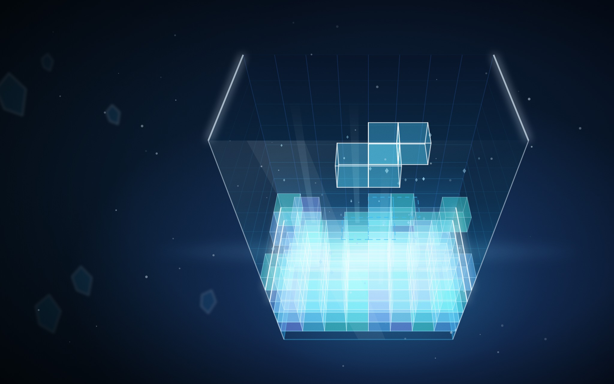
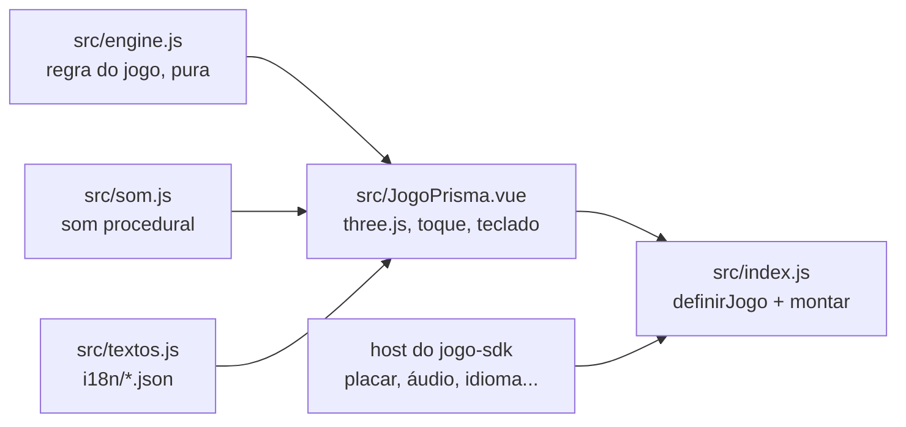

# Prisma

O PRISMA do [RoqueOS](https://roqueos.com.br): o clássico de peças que caem, desenhado em 3D.
Encaixe as peças, feche linhas para pontuar e segure o ritmo enquanto a queda acelera. Jogue
em [roqueos.com.br/jogar/prisma](https://roqueos.com.br/jogar/prisma).

_English below._

## Por que existe

Até 25/09/2026 este jogo morava dentro do repositório do RoqueOS e importava as stores do
sistema direto. Agora ele é um repo próprio na organização
[roqueos-games](https://github.com/roqueos-games), aberto, e fala com o RoqueOS só pelo
[`jogo-sdk`](https://github.com/roqueos-games/jogo-sdk). O mesmo código roda no RoqueOS,
sozinho no seu navegador (`yarn dev`) e no teste.

## Como se joga

| Ação            | Teclado         | Toque                   |
| --------------- | --------------- | ----------------------- |
| começar         | Espaço ou Enter | toque na tela           |
| mover           | ← → ou A D      | arraste para o lado     |
| girar (horário) | ↑ ou X          | toque rápido no poço    |
| girar (anti)    | Z ou Ctrl       | —                       |
| descer uma casa | ↓ ou S          | arraste para baixo      |
| derrubar        | Espaço          | puxe rápido para cima   |
| guardar a peça  | Shift ou C      | toque no quadro GUARDAR |
| pausar          | P               | —                       |

Linha fechada some e pontua pelo nível (100, 300, 500 e 800 por uma a quatro linhas, vezes o
nível). A cada dez linhas o nível sobe e a queda acelera.

## Arquitetura

- `src/engine.js` é a regra do jogo, sem Vue, sem DOM e sem `Math.random`: poço de 10 por 20,
  sete peças num saco embaralhado pela semente, giro com chute de parede, peça guardada e a
  curva de velocidade. Todo lance é reproduzível no teste.
- `src/JogoPrisma.vue` desenha o poço com [three.js](https://threejs.org) e ouve toque e
  teclado. Tudo o que vem do sistema (recorde da conta, áudio, perfil de aparelho fraco,
  métrica, idioma) chega pelo `host`. No perfil leve o jogo nasce sem antialias, sem sombra,
  com material mais simples e pixel ratio menor.
- `src/index.js` cria um app Vue próprio dentro do elemento que o host entrega e devolve
  `{ ativar, desmontar }`. Desmontar solta o laço, os ouvintes e o contexto WebGL.
- `jogo.json` é o manifesto: nome e descrição nos dez idiomas, SEO, etiquetas, capa, ícone,
  tamanho de janela e a chave do recorde. O RoqueOS confere que ele bate com o catálogo.

O `three` é `peerDependency`: o RoqueOS fornece o dele, e o jogo não traz outro. A versão exata
em `devDependencies` é a mesma que o RoqueOS instala, para o teste e o `yarn dev` verem o que
o jogador vê.

## Pré-requisitos

- Node 24 (o `.nvmrc` diz), ou 22 no mínimo.
- Yarn 1.22.

## Como rodar

1. `yarn install --ignore-scripts`
2. `yarn dev` e abra o endereço que o Vite mostrar: o jogo roda com o host de
   desenvolvimento do SDK, com o recorde no `localStorage`.
3. `yarn verificar` antes de abrir PR: lint, formato, testes e o `jogo check`, o mesmo que o
   CI roda.

O teste roda no jsdom, que não tem WebGL: o `three` é trocado por um dublê
(`test/threeStub.js`). Verde no teste não diz nada sobre o desenho na GPU. Mudança no código
que toca a GPU (renderer, materiais, luzes, sombras, pixel ratio, perfil leve) precisa ser
vista num iPhone de verdade antes de subir.

## Estrutura

| Caminho              | O que é                                                                |
| -------------------- | ---------------------------------------------------------------------- |
| `src/`               | o jogo (motor, tela, som, ícones, textos, entrada)                     |
| `i18n/`              | um JSON por idioma, com as mesmas chaves nos dez                       |
| `public/`            | capa e ícone; a origem de cada arquivo está no [ASSETS.md](ASSETS.md)  |
| `test/`              | testes com o host falso do SDK e o dublê do three, sem nada do RoqueOS |
| `dev/`, `index.html` | o jogo sozinho no navegador, para desenvolver                          |
| `jogo.json`          | o manifesto que o RoqueOS lê                                           |

## Onde ele se encaixa

O RoqueOS instala este repo por uma tag exata e monta o jogo pelo `mount` do SDK, na janela
do desktop e em `/jogar/prisma`. Uma mudança aqui só chega ao RoqueOS quando uma tag nova é
pinada lá, depois de revisada. As chaves de armazenamento (`best`, `muted`) e os nomes de
evento (`game_start`, `game_over`) não mudam: o recorde de quem já joga e o histórico de uso
dependem deles.

## Licença

MIT, no código e na arte própria. Veja [LICENSE](LICENSE) e [ASSETS.md](ASSETS.md).

---

## English

PRISMA from [RoqueOS](https://roqueos.com.br): the classic falling-block puzzle, rendered in
3D with three.js. It talks to RoqueOS only through the
[`jogo-sdk`](https://github.com/roqueos-games/jogo-sdk), so the same code runs inside
RoqueOS, standalone in your browser and in tests.

- `yarn install --ignore-scripts`, then `yarn dev` to play it locally.
- `yarn verificar` runs lint, formatting, tests and `jogo check`, exactly like CI.
- Controls: arrows or A/D move, Up or X rotates, Z or Ctrl rotates back, Down or S soft
  drops, Space hard drops, Shift or C holds, P pauses. On touch: drag, tap, flick up, and
  tap the HOLD box.
- `three` is a peer dependency: RoqueOS provides its own copy.
- Tests run in jsdom with a three.js stub, so they say nothing about GPU rendering. Changes
  to renderer, materials, lights, shadows, pixel ratio or the low-end profile need to be seen
  on a real iPhone before they ship.
- Code and comments are in Brazilian Portuguese; issues and pull requests in English are
  welcome.
- Storage keys (`best`, `muted`) and event names (`game_start`, `game_over`) are stable on
  purpose: existing players' records and analytics depend on them.

MIT licensed, code and original art.
